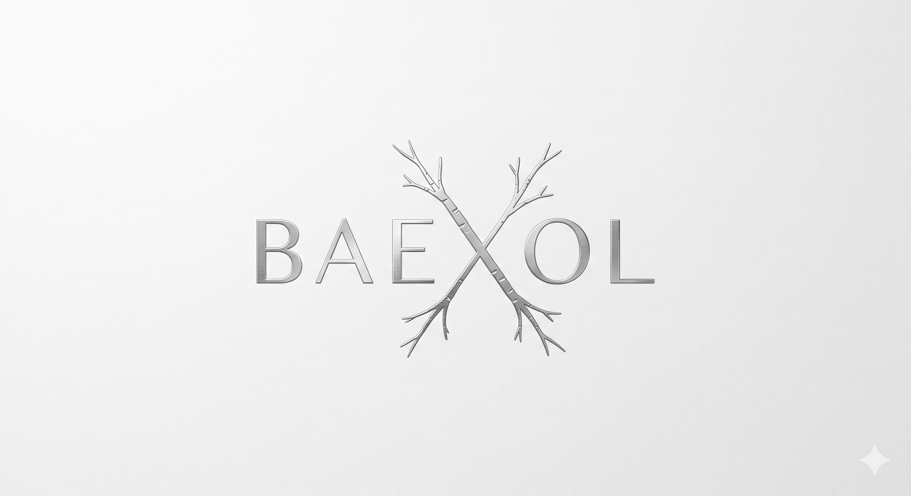

<div align="center">
  

  <h1>BAEXOL</h1>

  <p><strong>Full-Stack AI Engineer</strong></p>
  <p>초기 아키텍처 설계부터 고성능 AI 서빙까지, 제품의 처음과 끝을 책임집니다.<br/>
  <em>From initial architecture to high-performance AI serving — taking full ownership of the product lifecycle.</em></p>

  <p>
    
    
    
    
    
    
  </p>
</div>

---

## 👋 About

프론트엔드부터 **AI 추론 서빙**까지, 하나의 흐름으로 통제 가능한 시스템을 만듭니다. 프로토타입에서 실서비스로 — **범위와 구조를 스스로 정의하며** 시스템을 키우는 방식으로 일합니다. 화려한 기능보다 **방어 가능한 견고함(Zero-Defect)** 을 우선합니다.

화려한 기능보다 **방어 가능한 견고함(Zero-Defect)** 을 우선합니다. 병목 없는 클린 아키텍처, 명시적인 경계, 실패를 가정한 설계.

> 🌐 **Live:** [baexol.dev](https://baexol.dev) *(준비 중)*
> 🚧 이 저장소(`baexol`)는 포트폴리오 사이트 그 자체입니다. **레포 구조 = 아키텍처 접근을 보여주는 작업물**.

## 🏗️ Monorepo

프론트엔드와 헥사고날 아키텍처 백엔드를 하나의 워크스페이스에서 관리합니다.

```
baexol/
├── apps/
│   ├── web/        # Next.js 16 (App Router) · React 19 · Tailwind v4 — 포트폴리오 프론트
│   └── api/        # FastAPI · Hexagonal Architecture (ports & adapters)
│       └── src/baexol_api/
│           ├── domain/        # entities · ports (추상 인터페이스, 외부 의존 0)
│           ├── application/   # use cases (포트에만 의존)
│           └── adapters/      # inbound(HTTP routers) · outbound(repositories)
├── packages/       # 공유 패키지 (예정)
├── pnpm-workspace.yaml
└── package.json
```

**의존 방향**: `adapters → application → domain` (안쪽으로만). 도메인은 프레임워크·인프라를 모릅니다(DIP).

## 🧩 Tech Stack

| Layer       | Stack                                              |
| ----------- | -------------------------------------------------- |
| Frontend    | Next.js 16 (App Router), React 19, TypeScript, Tailwind CSS v4 |
| Backend     | FastAPI, Python 3.12+, Hexagonal Architecture      |
| Realtime/AI | WebRTC · WHEP, GStreamer, AI 모델 통합·추론 최적화·서빙 |
| Tooling     | pnpm workspaces, ESLint, Ruff                      |
| Deploy      | Vercel (web) · `baexol.dev`                        |

## 🚀 Getting Started

```bash
# Frontend (모노레포 루트)
pnpm install
pnpm dev                       # http://localhost:3000

# Backend (별도 가상환경 권장)
cd apps/api
pip install -e ".[dev]"
uvicorn baexol_api.main:app --reload   # http://localhost:8000/docs
```

## 📫 Contact

- **Email** · ybj19880612@gmail.com
- **GitHub** · [@ingking22](https://github.com/ingking22)

---

<sub>Engineered to a zero-defect standard.</sub>
